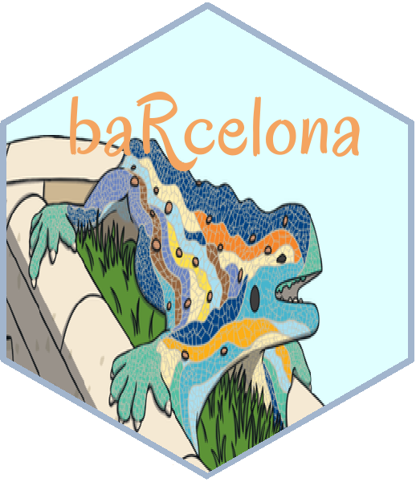

# baRcelona

# dplyr <a href='https://dplyr.tidyverse.org'></a>

<!-- badges: start -->
[](https://www.tidyverse.org/lifecycle/#experimental)
[](https://opensource.org/licenses/MIT)
[](https://github.com/dwyl/esta/issues)
[](http://hits.dwyl.com/xavivg91/baRcelona)
<!-- badges: end -->

## Overview

* **Catalogue management**. baRcelona is used to consult and manage the catalogue information available on the [Open Data BCN portal](https://opendata-ajuntament.barcelona.cat/en/node), 
such as data sets and their associated resources: ID, topic, author, source, department, etc. 

* **Retrieve CSV files**. Allows you to extract any CSV data set and load it directly in your RStudio environment. 

## Installation

```R
# install.packages("devtools")
devtools::install_github("xavivg91/baRcelona")
```
## Usage

`library(baRcelona)` will load the following core functions:

* `datasetlist()`, for catalogue management.

```R
# Retrieves all the current data sets
datasetlist()

# You can filter by topic
datasetlist(topic = c("Administration", "City and Services", "Economy and Business", "Population", "Territory"))

# ... and you can also filter by more specific topics
datasetlist(subtopic = c("Culture and Leisure", "Demography", "Education", "Employment", "Environment", 
                         "Housing", "Human resources", "Legislation and justice", "Participation", "Procurement",
                         "Public opinion", "Public sector", "Science and technology", "Security",
                         "Society and Welfare", "Sport", "Tourism", "Town planning and Infrastructures", "Trade",
                         "Transport"))
```                         

* `get.csv()`, for CSV data sets.

## How it works

Let’s say we want to obtain a data set related to sports. First, we need to execute the `dataselist()` function to see all the
sports data sets available on the Open Data BCN portal.

```R
# List of sports data sets available on the portal
datasets <- datasetlist(subtopic = "Sport")
```
Once executed, check out the saved data frame and copy the resource ID of the CSV you want to consult (inside the ID column). 
Then, paste the ID as an input argument of the `get.csv()` function. 

```R
# Save the CSV data set in your RStudio environment 
sportdataset <- get.csv(id = "cd8d0d2b-b97a-4aba-b1c8-e25696379a58")
```

Easy peasy, right?

## Data Ownership

All extracted baRcelona data belong to the [Open Data BCN portal](https://opendata-ajuntament.barcelona.cat/en/node).
